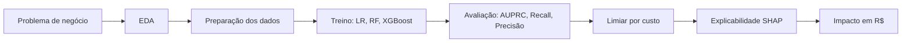
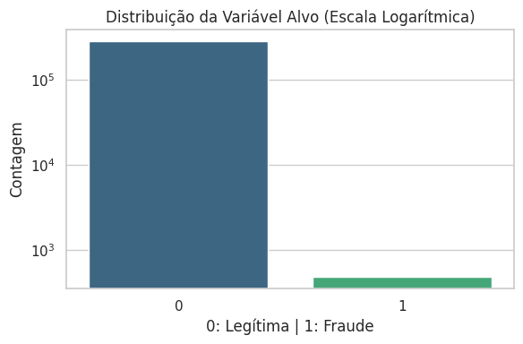
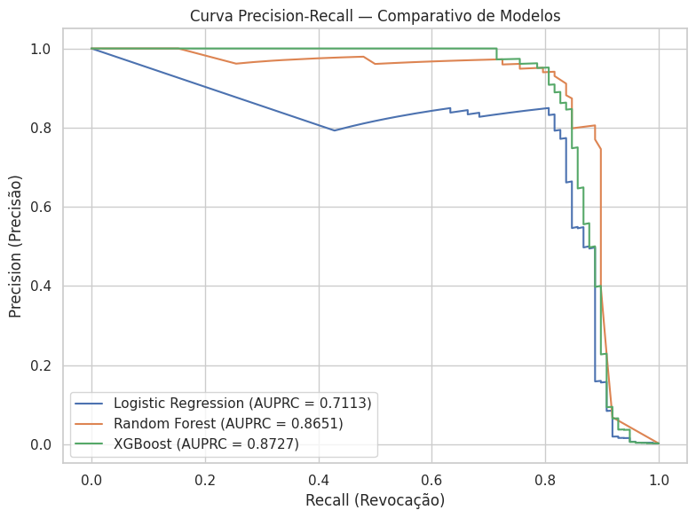
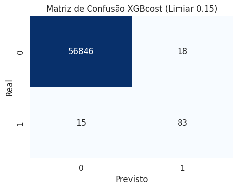
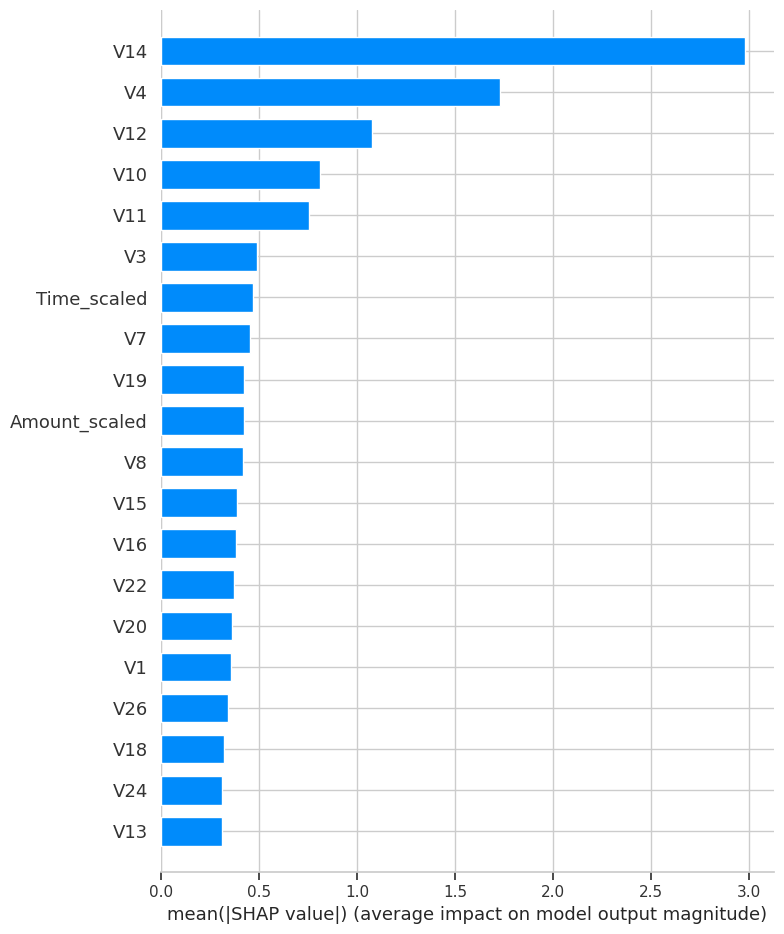

# 💳 Detecção de Fraudes em Cartão de Crédito sob Extremo Desequilíbrio de Classes

[](https://www.python.org/)
[](https://scikit-learn.org/)
[](https://xgboost.readthedocs.io/)
[](https://shap.readthedocs.io/)
[](https://colab.research.google.com/github/Santosdevbjj/deteccao-de-anomalias-em-transacoes-em-python/blob/main/notebooks/transacoesCartaoCredito.ipynb)

**Bootcamp Bradesco - GenAI, Dados & Cyber (DIO)**

> Fraudes representam **0,172%** das transações. Um modelo que aprova tudo tem 99,8% de acurácia e **zero** utilidade. Este projeto resolve o problema real: **capturar o máximo de fraudes ao menor custo financeiro**, com um modelo que o negócio consegue auditar.

---

## 📌 Visão Geral

Pipeline de Machine Learning treinado em **284.807 transações reais** de cartões europeus (492 fraudes). Compara três modelos, ajusta o limiar de decisão com base no **custo de negócio** (e não na acurácia) e explica as decisões do modelo com **SHAP**.

| Indicador (conjunto de teste, 56.962 transações) | Resultado |
| :--- | :---: |
| Modelo escolhido | XGBoost, limiar de decisão 0,15 |
| Recall na classe fraude | **84,69%** (83 de 98 fraudes capturadas) |
| Precisão na classe fraude | **82,18%** (18 falsos alarmes) |
| AUPRC | **0,8727** |
| Redução de custo vs. "aprovar tudo" (simulação) | **84,5%** (R$ 41.410 no teste) |

---

## 1. Problema de Negócio

Fraudes não detectadas geram estorno (*chargeback*), custo regulatório e perda de confiança do cliente. Alertas falsos geram atrito, mas custam muito menos.

O desafio: **encontrar o maior número possível de fraudes sem inundar a operação com falsos alarmes**. Na prática, é um problema de **minimização de custo assimétrico**:

`Custo Total = (FN × C_FN) + (FP × C_FP)`

## 2. Contexto

- **Dados:** transações de cartão de crédito de titulares europeus, setembro de 2013, coletadas em colaboração entre Worldline e o grupo de ML da ULB.
- **Volume:** 284.807 transações em 2 dias; 284.315 legítimas (99,827%) e 492 fraudulentas (0,172%).
- **Variáveis:** `V1` a `V28` (componentes PCA, anonimizadas por sigilo), `Time` (segundos desde a 1ª transação), `Amount` (valor) e `Class` (1 = fraude, 0 = legítima).
- **Origem do CSV:** baixado em tempo de execução via URL no notebook. O arquivo não é versionado (ver `.gitignore`).

## 3. Objetivo do Projeto

Demonstrar, ponta a ponta, como tratar um problema de classificação com desequilíbrio extremo: escolher a métrica certa, comparar modelos contra um baseline, calibrar o limiar pelo custo e traduzir o resultado técnico em **reais (R$)**.

## 4. Baseline

Dois pontos de comparação:

1. **Baseline de negócio, "aprovar tudo":** acurácia de 99,83%, Recall de 0%. Custo simulado no teste: **R$ 49.000** (98 fraudes × R$ 500).
2. **Baseline de ML, Regressão Logística** (`class_weight='balanced'`): Recall alto (91,84%), mas Precisão de apenas 6,01%, gerando cerca de 1,4 mil falsos alarmes no teste.

Qualquer modelo precisa vencer os dois em **custo total**, não em acurácia.

## 5. Premissas

- **A acurácia é descartada** como métrica. As métricas oficiais são **Recall da classe 1**, **Precisão** e **AUPRC** (recomendada pelos autores do dataset para bases desbalanceadas).
- **Divisão estratificada 80/20** (*hold-out* com `stratify=y`, `random_state=42`): preserva ~0,172% de fraudes no treino (0,00173) e no teste (0,00172).
- **Custos simulados (hipóteses de negócio, não dados reais):** R$ 500 por fraude não detectada (FN) e R$ 5 por alerta falso (FP). Os valores são fixos por ocorrência e não usam a coluna `Amount`.
- `Amount` está em euros no dataset original; os custos em R$ são uma simulação ilustrativa.

## 6. Estratégia da Solução



**Tecnologias:** Python, Pandas e NumPy (dados), Scikit-Learn (baseline, Random Forest, métricas), XGBoost (modelo final), SHAP (explicabilidade), Matplotlib e Seaborn (visualização), Jupyter/Colab (execução).

## 7. Decisões Técnicas e Trade-offs

| Decisão | Por quê | Trade-off aceito |
| :--- | :--- | :--- |
| **AUPRC como métrica principal** | Com 0,17% de positivos, a curva ROC-AUC parece boa mesmo com modelos ruins | Menos intuitiva para públicos não técnicos |
| **`class_weight` / `scale_pos_weight`** em vez de SMOTE | Trata o desbalanceamento sem gerar dados sintéticos e sem alterar a distribuição do teste | Pode ser menos eficaz que reamostragem combinada (fica como próximo passo) |
| **XGBoost como modelo final** | Melhor AUPRC (0,8727) e melhor equilíbrio Recall/Precisão | Menos interpretável que a Regressão Logística, compensado com SHAP |
| **Limiar 0,15 em vez de 0,50** | Um FN custa 100× mais que um FP na simulação | O F1 cai (0,8571 → 0,8342); o ganho depende da razão de custos assumida |

**Limitações conhecidas (transparência técnica):**

- O limiar de 0,15 foi escolhido observando o **próprio conjunto de teste**. Em um cenário real, ele deve ser calibrado em um conjunto de **validação** separado, para não superestimar o resultado.
- O teste tem apenas **98 fraudes**. Cada fraude a mais ou a menos move o Recall em ~1 ponto percentual. Os resultados têm alta variância.
- Os `StandardScaler` foram ajustados sobre o dataset inteiro antes da divisão (vazamento leve de estatísticas). Em produção, ajustar apenas no treino.
- A divisão é aleatória, não temporal. Não há avaliação de degradação por *concept drift*.

## 8. Preparação e Análise dos Dados

- **Assimetria de `Amount`:** transformação `log1p` seguida de `StandardScaler` (`Amount_scaled`).
- **`Time`:** padronizado com `StandardScaler` (`Time_scaled`).
- **Features finais:** `V1`–`V28` + `Amount_scaled` + `Time_scaled` (30 variáveis).
- **Limpeza:** o notebook não aplica tratamento adicional de nulos ou duplicados. A inspeção de qualidade de dados é um próximo passo.

<p align="center">
  
</p>

## 9. Treinamento dos Modelos

| Modelo | Configuração |
| :--- | :--- |
| Regressão Logística | `class_weight='balanced'`, `max_iter=1000` |
| Random Forest | `n_estimators=100`, `class_weight='balanced'` |
| XGBoost | `scale_pos_weight` = legítimas / fraudes no treino, `eval_metric='logloss'` |

Todos com `random_state=42` para reprodutibilidade.

## 10. Performance dos Modelos

| Modelo / Configuração | Recall | Precisão | F1 | AUPRC | FP | FN |
| :--- | :---: | :---: | :---: | :---: | :---: | :---: |
| Baseline: Regressão Logística | 91,84% | 6,01% | 0,1129 | 0,7113 | ~1,4 mil | 8 |
| Random Forest | 75,51% | 96,10% | 0,8457 | 0,8651 | 3 | 24 |
| XGBoost (limiar 0,50) | 82,65% | 89,01% | 0,8571 | 0,8727 | 10 | 17 |
| **XGBoost (limiar 0,15)** | **84,69%** | **82,18%** | 0,8342 | **0,8727** | **18** | **15** |

<p align="center">
  
  
</p>

**Leitura:** a Regressão Logística captura muitas fraudes, mas com atrito inviável. O Random Forest é preciso, porém conservador, deixando passar 24 fraudes (24,5%). O XGBoost com limiar 0,15 entrega o melhor equilíbrio: 83 de 98 fraudes capturadas (TP = 83, FN = 15, FP = 18, TN = 56.846).

## 11. Business Performance: o erro do modelo em Reais

Simulação no conjunto de teste (56.962 transações, 98 fraudes), com C_FN = R$ 500 e C_FP = R$ 5:

| Cenário | Fraudes capturadas | FN | FP | Custo total | Redução vs. aprovar tudo |
| :--- | :---: | :---: | :---: | :---: | :---: |
| Aprovar tudo (sem modelo) | 0 | 98 | 0 | R$ 49.000 | n/a |
| Regressão Logística | 90 | 8 | ~1,4 mil | ~R$ 11.000 | ~77% |
| Random Forest | 74 | 24 | 3 | R$ 12.015 | 75,5% |
| XGBoost (limiar 0,50) | 81 | 17 | 10 | R$ 8.550 | 82,6% |
| **XGBoost (limiar 0,15)** | **83** | **15** | **18** | **R$ 7.590** | **84,5%** |

- **Economia líquida no teste:** R$ 49.000 − R$ 7.590 = **R$ 41.410**.
- **Efeito do limiar:** baixar de 0,50 para 0,15 economizou R$ 960 no teste, capturando 2 fraudes a mais ao custo de 8 alertas falsos adicionais.
- **Extrapolação:** a base completa tem 5× o tamanho do teste, o que projeta uma economia estimada de **~R$ 207 mil** (estimativa ilustrativa, sujeita às premissas de custo acima).

## 12. Insights e Explicabilidade (SHAP)

<p align="center">
  
</p>

- As variáveis **V14, V4, V12, V10 e V11** são as que mais pesam no score de risco do XGBoost.
- `Time_scaled` e `Amount_scaled` têm papel secundário frente às componentes PCA.
- A explicabilidade permite justificar decisões em contextos regulados (LGPD, Bacen), embora as componentes PCA sejam anonimizadas e limitem a interpretação de negócio de cada variável.
- *Nota metodológica:* o gráfico foi calculado sobre as primeiras 1.000 linhas do teste, uma amostra com poucas fraudes (~0,17% esperado). Para conclusões mais firmes, recalcular com todas as fraudes do teste.

## 13. Resultados e Recomendação

- **Recomendação:** adotar o XGBoost com limiar 0,15 como candidato à operação, condicionado à recalibração do limiar em base de validação e à validação com os custos reais da instituição.
- **Por que resolve o problema:** reduz ~84% do custo simulado e mantém a Precisão acima de 80%, ou seja, 4 em cada 5 alertas são fraudes reais.
- **Alerta:** a decisão depende da razão de custos FN/FP. Se ela mudar, o limiar ótimo muda junto.

## 14. Próximos Passos

- [ ] Calibrar o limiar em conjunto de validação separado e comparar com busca por custo mínimo.
- [ ] Validação temporal (*time-series split*) para avaliar *concept drift*.
- [ ] Tratar duplicados e checar qualidade de dados antes do split.
- [ ] Testar reamostragem combinada (SMOTE + Tomek Links) contra o `scale_pos_weight`.
- [ ] Custo por transação usando `Amount` (aprendizado sensível a custo dependente de exemplo).
- [ ] Servir o modelo via API (FastAPI), somente se o projeto evoluir para uso real.

---

## ▶️ Como Executar

**Pré-requisitos:** Python 3.10+, Git e conexão com a internet (o dataset é baixado durante a execução).

```bash
# 1. Clonar o repositório
git clone https://github.com/Santosdevbjj/deteccao-de-anomalias-em-transacoes-em-python.git
cd deteccao-de-anomalias-em-transacoes-em-python

# 2. Criar e ativar o ambiente virtual
python -m venv venv
source venv/bin/activate      # Linux/Mac
# venv\Scripts\activate       # Windows

# 3. Instalar dependências
pip install -r requirements.txt

# 4. Executar o notebook
jupyter notebook notebooks/transacoesCartaoCredito.ipynb
```

Ou abra direto no Colab pelo botão no topo deste README.

## 🗂️ Estrutura do Repositório

```text
deteccao-de-anomalias-em-transacoes-em-python/
├── .gitignore
├── README.md
├── requirements.txt
├── assets/
│   ├── distribui_classe.png
│   ├── curva_precision_recall.png
│   ├── matriz_confusao_xgboost.png
│   └── shap_importance.png
├── docs/
│   └── analise.md
└── notebooks/
    └── transacoesCartaoCredito.ipynb
```

## 📚 Referências

- Dal Pozzolo, A. et al. *Calibrating Probability with Undersampling for Unbalanced Classification*. IEEE CIDM, 2015.
- Dal Pozzolo, A. et al. *Learned Lessons in Credit Card Fraud Detection from a Practitioner Perspective*. Expert Systems with Applications, 2014.
- Dal Pozzolo, A. et al. *Credit Card Fraud Detection: A Realistic Modeling and a Novel Learning Strategy*. IEEE TNNLS, 2018.
- Carcillo, F. et al. *Combining Unsupervised and Supervised Learning in Credit Card Fraud Detection*. Information Sciences, 2019.
- Le Borgne, Y.-A. & Bontempi, G. *Reproducible Machine Learning for Credit Card Fraud Detection: Practical Handbook*.
- Lundberg, S. M. & Lee, S.-I. *A Unified Approach to Interpreting Model Predictions*. NeurIPS, 2017.

---

> *"O mercado de trabalho não contrata ferramenta, o mercado de trabalho contrata quem resolve problemas."* — Meigarom Lopes

**Autor:** Sérgio Santos — Cientista de Dados | Ambientes Críticos e Governança de Dados

[](https://portfoliosantossergio.vercel.app)
[](https://linkedin.com/in/santossergioluiz)
